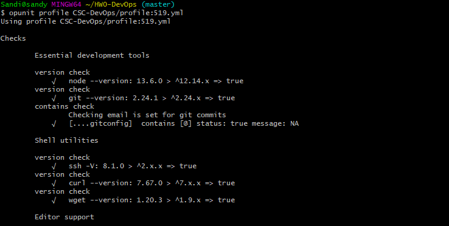
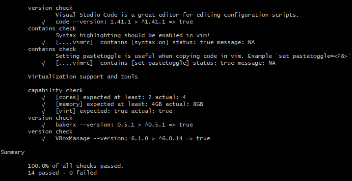
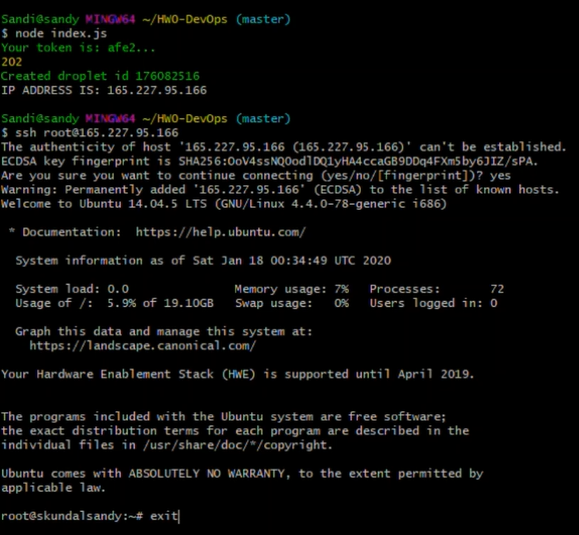
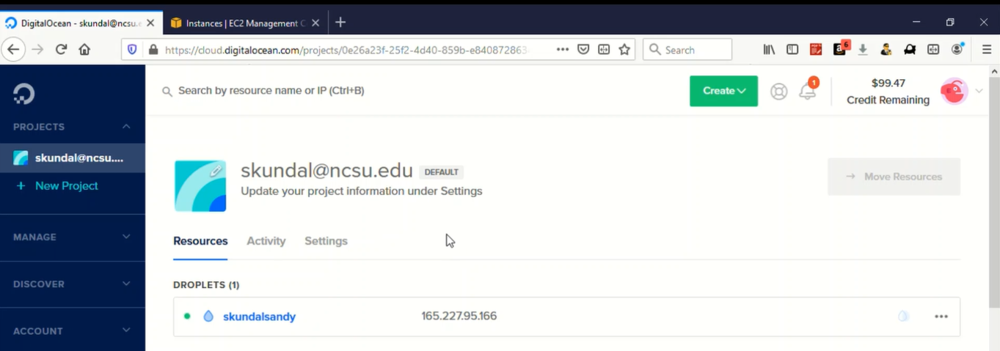
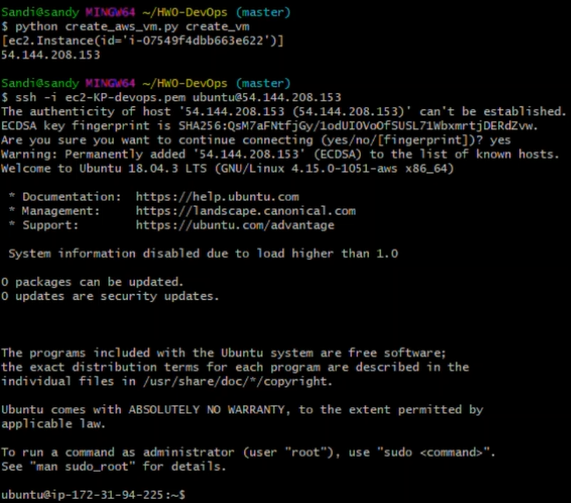
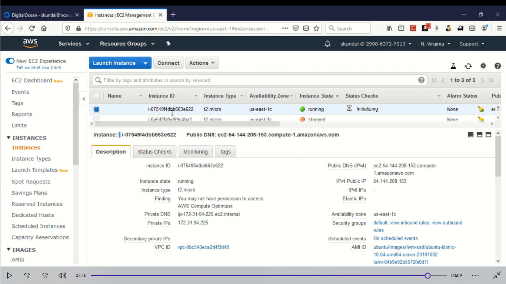

# HW0-DevOps

## Basic course setup (10)
**Moodle**: [Moodle Profile Page](resources/moodle_profile.png)

**Mattermost**: [Mattermost Profile Page](resources/mattermost_profile.jpeg)

**Stack Overflow**: [Stack Overflow Profile Page](resources/stackoverflow_profile.png)


## Github (10)
- [X] Create GITHUB private repository.
- [X] Add Professor and TAs as collaborators.

[Github Repo creation and adding collaborators](resources/devops_hw0_1.png)


## Asking a Question, Answering a Question (10)
The question can be found [here](https://stackoverflow.com/c/ncsu/questions/1091)

The answer provided can be found [here](https://stackoverflow.com/c/ncsu/questions/1096/1120#1120)

## Opunit checks (10)
`opunit profile CSC-DevOps/profile:519.yml` <br>





## Provisioning (50)
### DigitalOcean



### AWS



## Screencast
The video link is [here](https://drive.google.com/open?id=1x_fcCxPQs2RZ2Xa6GyjCqjqt8ZwrEhfX)

## Setup:
Git clone the repository <br>
```
git clone https://github.ncsu.edu/skundal/HW0-DevOps.git
cd HW0-DevOps
```
### Setup for DigitalOcean:

Follow the instructions to create ssh keys and link it with DO account: https://www.digitalocean.com/docs/droplets/how-to/add-ssh-keys/create-with-openssh/

To install packages:`npm install`

To run the program: `node index.js`

[Droplet creation CODE HERE](index.js)

### Setup for AWS:

Follow the instruction to create IAM User and configuring AWS in the local machine: https://blog.ipswitch.com/how-to-create-an-ec2-instance-with-python

To install packages: `pip install -r requirements.txt`

To create new keypair: `python create_aws_vm.py create_kp` 

To run program: `python create_aws_vm.py create_vm`  

[Instance creation CODE HERE](create_aws_vm.py)
