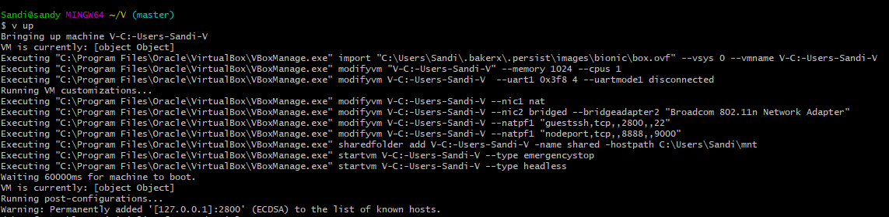
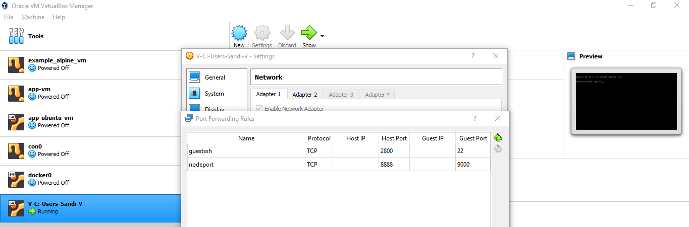
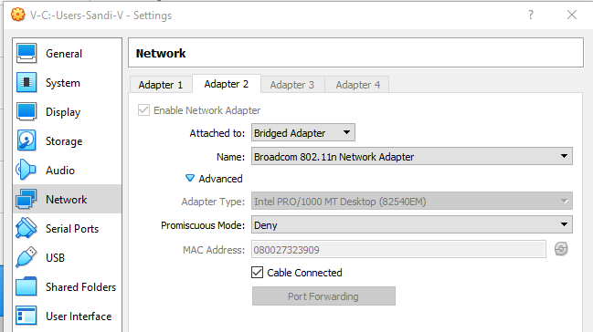
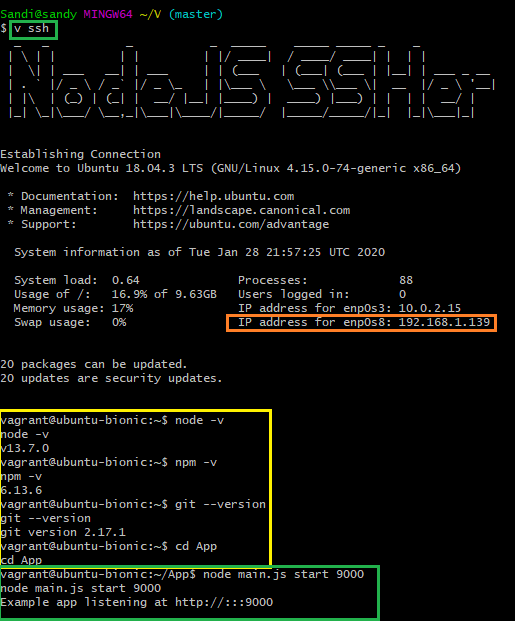
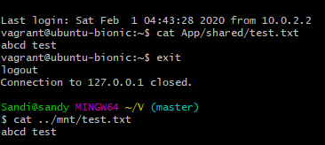

# HW1-DevOps

## Instructions <br>
1. Git clone this repository
2. Install packages and link:<br>
```
cd V
npm install
npm link
```

## VM Setup (40)
To deploy VM: `v up`<br>
<p align="center"> Output of v up command
  
</p>
<p align="center"> NIC 1 - NAT Mode - Port Forwarding (8888 -> 9000)
  
</p>
<p align="center"> NIC 2 - Bridged Mode - (Extra requirement)
  
</p>

## Post-Configuration (25) & SSH and App (25)
To ssh into the deployed VM: `v ssh`<br>
<p align="center"> Output of v ssh command <br>
  
</p>
<p align="center"> Output in web browser (with extra requirement on the right)
  
</p>


## Extra Requirement (20)
1. 2nd NIC in bridged mode and access webpage using ip_address:9000
2. Shared File <br>
<p align="center">
  
</p>

## Screencast (10)
https://drive.google.com/open?id=18X6Ned-IuMcgFxDA0n4LIWpxp8cCBPvT

## Answer a question (5)
https://stackoverflow.com/c/ncsu/questions/1290/1296#1296

