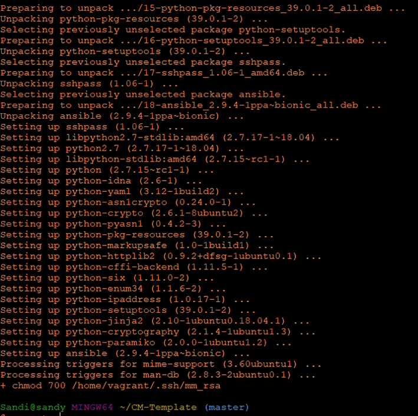
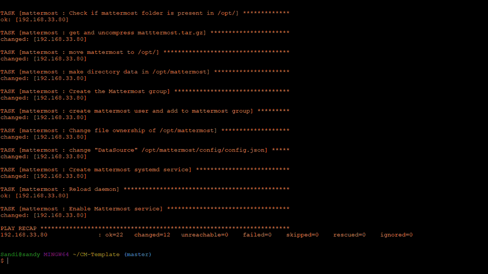
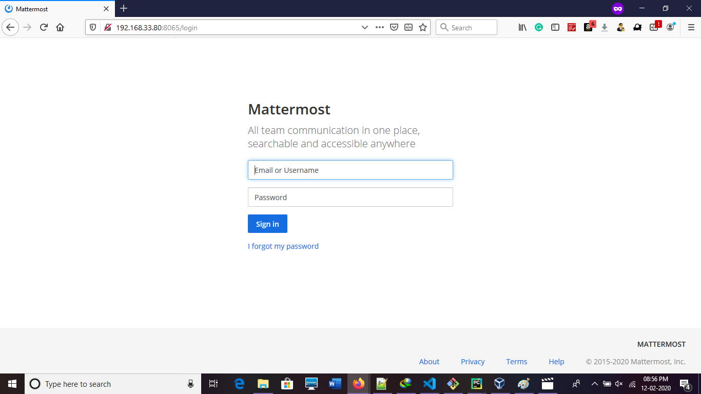
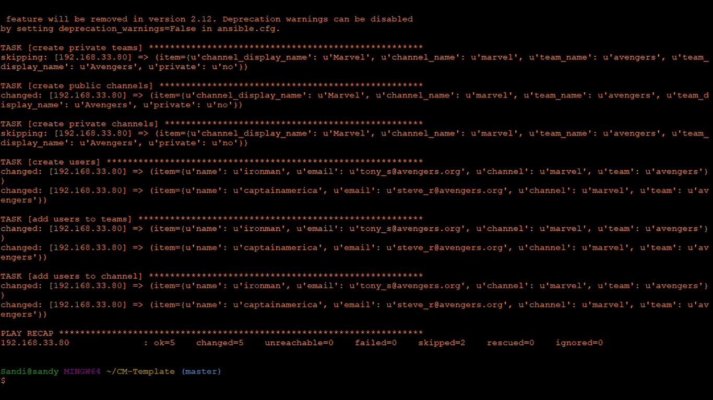
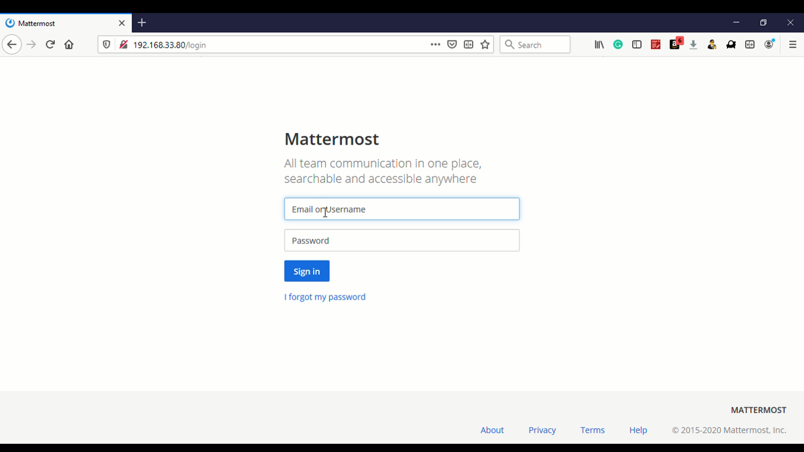
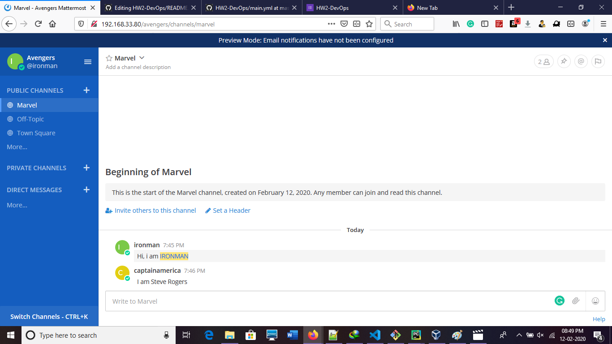
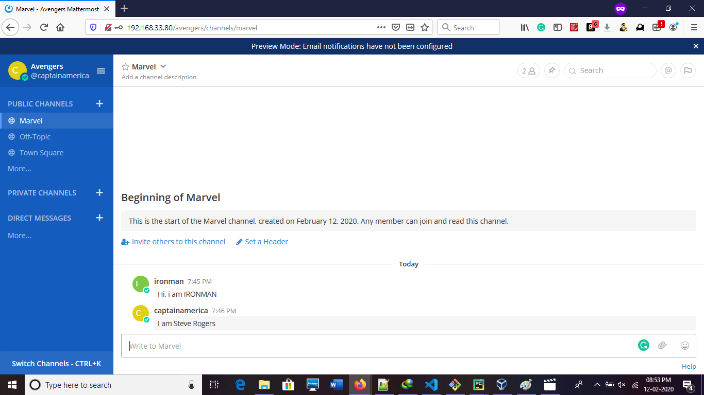

# HW2-DevOps
<br>
This repository helps the software engineers to provision and configure virtual machines and mattermost

## Setup

Clone this repo:

```bash
git clone <repo>
```

Install the node.js packages.

```bash
cd HW2-DevOps
npm install
npm link
```

Provision ansible-srv and mattermost-srv using the command: 
```bash
cm setup
```

To install packages in matermost-srv, run 
```bash
cm playbook cm/playbook.yml cm/inventory.ini
```

To create teams, run 
```bash
cm playbook cm/extra_requirements/mm_server.yml cm/inventory.ini
```

To, configure NGINX as a proxy for Mattermost Server, run 
```bash
cm playbook cm/extra_requirements/nginx.yml cm/inventory.ini
```

## Output:

### Basic Requirements (50 points):

The code is available [here](cm/playbook.yml) <br>
Roles were created to execute tasks related to [packages](cm/roles/packages/tasks/main.yml), [mysql](cm/roles/mysql/tasks/main.yml) and [mattermost](cm/roles/mattermost/tasks/main.yml).

The corresponding screenshots are:

<p align="center">
cm setup output: <br>



</p>

<p align="center">
ansible playbook output:<br>


</p>

Result:
<p align="center">
Mattermost without proxy
<br>

<br>
</p>

### Extra requirements (attempted 15 points)

The code for creating user, team and channel is available [here](cm/extra_requirements/mm_server.yml)

<p align="center">

</p>

The code for nginx as proxy is [here](cm/extra_requirements/nginx.yml)

Mattermost with proxy

<p align="center">

<br>
<p>

## Best Practices

- Created roles to execute tasks.
- Encrypted password files

## Verification
User 1 mattermost<br>
<p align="center">

</p>
<br>

User 2 matttermost<br>
<p align="center">

  </p>

## Screencast (20 points)
The screencast link is available [here](https://drive.google.com/open?id=1MdpbJnanBmpqg5upqay4a8mmlPzfkncy)

