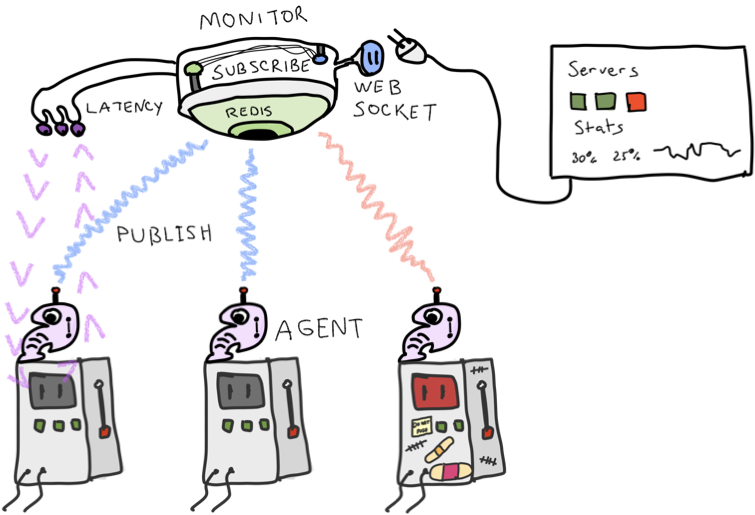
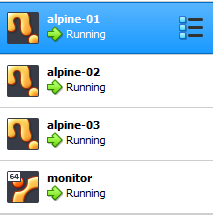
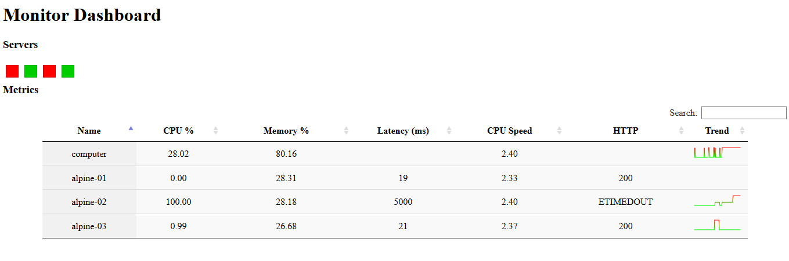
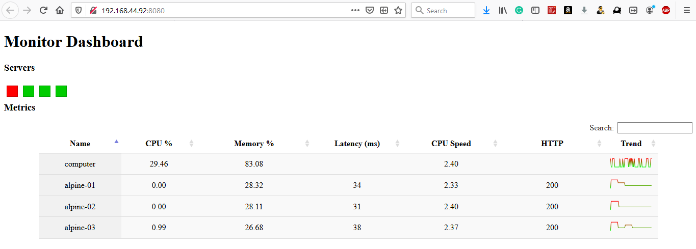

# HW4-DevOps: Monitoring

In this homework I have learned the basic principles related to establishing a monitoring infrastructure.  

### Monitoring Architecture



The monitoring infrastructure has several components.

## Workshop

Clone this repository.
```bash
git clone <repo>
```

Pull the following bakerx images.

```bash
# Updated to allow redis access from remote hosts
bakerx pull CSC-DevOps/Images#Spring2020 queues
bakerx pull CSC-DevOps/Images#Spring2020 alpine-node
```

Bring up the infrastructure.

```bash
cd HW4-DevOps/servers
npm install
node index up
```

Inspect the console output for any errors, then confirm VMs have started in VirtualBox.



Open a terminal dedicated to the monitor instance and ssh into machine, `bakerx ssh monitor`.
Change into dashboard directory (which will be mounted at `/bakerx`), install packages, and start dashboard service.

```bash
cd /bakerx
npm install
node bin/www
```

Visit the monitoring dashboard at http://192.168.44.92:8080/. Confirm you can see the dashboard running.

### Monitoring infrastructure

#### Task 1: Add memory/cpu metrics.

- Modified `function memoryLoad()` to calculate the amount of memory currently used by the system as a percentage.
- Modified `function cpuAverage()` to calculate the amount of load the cpu is under as a percentage. 

In host VM terminal's HW4-DevOps repository

```
cd agent/
node index.js computer
```

##### Install agent on servers.

Deploy agent to run on the servers by using the `push` command provided in the driver:

```bash
cd servers/
node index.js push
```

Memory and cpu information will be displayed in the dashboard for all the servers, including host computer.

#### Task 2: Latency and HTTP status codes.

- Modified `dashboard/metrics/index.js` to collect the latency and status code of the http response (`res.statusCode`).


#### Task 3: Calculate and display server health.

- Updated the code inside `dashboard/metrics/index.js#updateHealth(server)` to create a metric that calculates an overall score from memoryLoad, cpu, latency, and statusCode where 4 is good healthy and 0 is unhealthy

#### Task 4: Load services.

The load in alpine-01 server increased when the following sites are visited:

* http://localhost:9001/
* http://localhost:9001/stackless
* http://localhost:9001/work

The load in alpine-02 server increased when the following sites are visited:

* http://localhost:9002/
* http://localhost:9002/stackless
* http://localhost:9002/work

The load in alpine-03 server increased when the following sites are visited:

* http://localhost:9003/
* http://localhost:9003/stackless
* http://localhost:9003/work


##### Installing siege
In a new terminal
```bash
bakerx ssh monitor
apt-get install siege
```

Note: You should use the ip of your host computer (see dashboard/metrics/ip.txt) instead of localhost to create the desired effect.

Experiment with loading the server by hitting different endpoints.
```
siege -b -t30s http://<ip>:9001/
siege -b -t30s http://<ip>:9001/stackless
siege -b -t30s http://<ip>:9001/work
```



#### Task 5: New metric.

- Added a new metric in the agent and display it in the dashboard: CPU Speed (GHz)

#### Output:


### Screencast
The screencast is [here](https://drive.google.com/open?id=1lLvREKHqbl3PdB7yc0xuoxKb9j7vTFBj)

### Conceptual Deployment Questions

**1. Compare a channel deployment model with a ring deployment model.** </br>
A. In Channel Deployment, changes are tested in a channel and promoted to next channel every 2 weeks unless fast tracked by release engineer whereas in Ring deployment, change is promoted from internal users to early adopters and wider and wider groups of users. Change can stay in a ring for weeks in ring deployment model.

**2. Identify 2 situations where an expand/contract deployment could be useful.** </br>
A. 
- Firm which requires to maintain continuous operation/availability of services without any downtime.
- To reduce the risk of each release or deployment to the minimum. Small batches always reduce the risk, because it helps to identify the issues quickly and helps us to be more resilient. In case an application of a company runs into bugs, the issues can be approached as easly as possible.

**3. What are some tradeoffs associated with dark launches?** </br>
A. 
- Difficult to adopt since change of application is required to deploy. Development teams must build the capability to dark-launch or toggle a feature into the application at the code level, but doing so can be a challenge for mature applications with a large code base.
- Inconsistent user experiences can reduce customer/user satisfaction.
- Supporting multiple permutations of software can increase engineering costs and reduce stability.

**4. Describe the Netflix style green-blue deployment. What can canary analysis tell us?** </br>
A. Netflix uses Red/Black (Blue/Green) deployment where a new version of app is placed in red (or blue) will start to receive traffic as soon as it passes health checks. Once the red version is healthy, the previous (black) version is disabled and receives no traffic. If a rollback is needed, making a change is as simple as enabling the previous version.

Canary analysis is an effective way to validate live traffic against new changes to a service. Based on confidence intervals, computed by the Mann-Whitney U test, each metric is classified whether a significant difference exists between the canary and baseline metrics.


